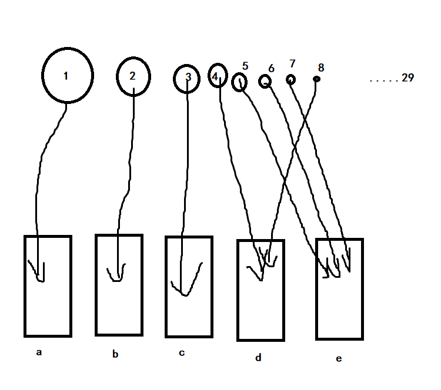

# task 1

不公平。理由：

1. 在资源分配中应该考虑到每个人的权利和需要，而不是仅仅根据个人的喜好来决定。按照谁更喜欢来分配货物可能会忽略那些有更大需求但可能没有表达出更多喜好的人的权利，导致资源分配不公正。

2. 每个人都应该有平等的机会和权利，而不应该因为个人的偏好而获得不同的待遇。按照谁更喜欢来分配货物可能会导致一些人获得过多的资源，而其他人则获得过少，造成不平等现象。
   
   

# task 2

| 变量名           | 含义               |
|:-------------:|:----------------:|
| $F$           | 表示分配方式的公平程度      |
| $s_a$         | 表示 $a $获得所有物品的价值总和 |
| $s_{ai}$      | 表示物品 $i $在 $a $手中的价值 |
| $v_a$         | 表示 $a $所有物品的估值总和   |
| $v_{ai}$      | 表示 $a $对物品 $i $的估值   |
| $\alpha _{a}$ | 表示 $a $总体估值的高低     |

 分配标准的好坏由公平程度 $F $衡量

五个人分别表示为 $a $， $b $， $c $， $d $， $e $

物品表示为数字 $1 $， $2 $，......， $26 $

$F $用 $(s_a,s_b,s_c,s_d,s_e) $的方差衡量

$$
s_a = \sum s_{ai}（i分配给了a）\\
s_{ai} = \alpha _{a} \cdot v_{ai} \\
\alpha _a = \frac{mean(v_a,v_b,v_c,v_d,v_e)}{v_a} \\
v_a = \sum v_{ai}
$$

最终最佳的分配标准应该使 $F $尽可能小

## $\alpha _a $的作用与计算原理

假设有1,2,3三样物品需分配给 $a $， $b $两人，各自估价如图所示

| $v_{ai}$ | $a$ | $b$ |
|:--------:|:---:|:---:|
| 1        | 40  | 15  |
| 2        | 30  | 25  |
| 3        | 50  | 20  |
| $v_a$    | 120 | 60  |

若果按照 $v_{ai} $分配物品，则所有物品都将分配给 $a $，显然是不公平的，这是因为所有人对钱的观念不同。

注意到表中物品基本均匀覆盖了生活的每个方面，现做出一个假设：**表中所有物品对所有的人的价值都相同**

基于以上假设我们可以得到

$$
\sum s_{ai} = \sum s_{bi} = \sum s_{ci} =\sum s_{di} =\sum s_{ei} \\ \Downarrow \\
v_{a} \cdot \alpha _{a} = v_{b} \cdot \alpha _{b} = 
v_{c} \cdot \alpha _{c} = v_{d} \cdot \alpha _{d} = 
v_{e} \cdot \alpha _{e}
$$

令上式 $=mean(v_{a},v_{b},v_{c},v_{d},v_{e}) $得到

$$
\alpha _a = \frac{mean(v_a,v_b,v_c,v_d,v_e)}{v_a}
$$

此为 $\alpha _{a} $及其公式的由来

## 具体实现过程

1. 将pdf中 $v_{ai} $的数据储存在data/origin.csv中

2. 计算出 $s_{ai} $并导出到data/value.csv中
   
   ```python
   import pandas as pd
   import numpy as np
   
   df = pd.read_csv("./data/origin.csv")
   people_num = 5
   people_sum = [0]*5
   
   for i in range(people_num):
       people_sum[i] = df.iloc[:, i+2].sum()
   people_mean = np.mean(people_sum) / people_sum
   
   df.iloc[:, 2:] *= people_mean
   df.to_csv("./data/value.csv", index=False)
   ```

3. 求出 $F $最小

实现思路：先分配价值大的，后用小的调整方差



实现策略：

1. 先计算出每样物品价值的平均值，按平均值由大到小排序

2. 遍历每一样物品，分别计算分给四个人后个人价值总和的方差，选取方差最小的情况

```python
import pandas as pd
import numpy as np

df = pd.read_csv("./data/value.csv")
df["max"] = df.iloc[:, 2:].max(axis=1)
df = df.sort_values(by="max", ascending=False).reset_index(drop=True)

people_num = 5
people_value = np.zeros(people_num)
i_list = []
for index, row in df.iterrows():
    value_var = np.inf
    for i in range(people_num):
        current_value = people_value.copy()
        current_value[i] += row[i+2]
        current_var = np.var(current_value)
        if current_var < value_var:
            min_i, value_var = i, current_var
    i_list.append(min_i)
    people_value[min_i] += row[min_i+2]

goods = {
    0: [],
    1: [],
    2: [],
    3: [],
    4: []
}
people = ["爱丽丝", "鲍勃", "查理", "大卫", "艾琳"]
for i in range(len(i_list)):
    goods[i_list[i]].append(df[" 货物"][i])
for i in range(people_num):
    print("%s获得了%s, 总价值%.2f元" % (people[i], ", ".join(goods[i]), people_value[i]))
print("F=%.5f" % np.var(people_value))
```

运行结果如下：

```
爱丽丝获得了 扫描夸克显微镜,  一段丝绸布料,  可疑的机械零件,  卢克的出生证明,  无可疑机械零件, 总价值521.96元
鲍勃获得了 古董iPhone17（良好状态）,  宠物狗-蝴蝶混种（处于冷冻状态）,  稀有纸质书籍包装盒,  卷起式300英寸平板电视,  茅膏菜-南瓜种子,  自动鸡计数器,  夏季鞋子,  餐具套装, 总价值523.85元
查理获得了 高中生纠错工具,  激光剑（损坏）,  “我们曾被称为BTS”回忆录（书籍）,  可折叠物业（高税）,  便携式工具箱,  餐桌餐具套装, 总价值522.28元
大卫获得了 网络视频传输设备,  电子温度计（实验室级别）,  全息甲板访问钥匙卡,  一瓶Melange香料,  生存食品包装盒,  阿尔巴尼亚键盘,  太空蝴蝶结, 总价值523.28元
艾琳获得了 太空服,  计算机内存条,  针织毛衣,  可调谐波长投影仪, 总价值527.34元
F= 3.69843
```

算法优缺点：

- 优点：将时间复杂度从原先的 $O(m^n) $降至 $O(m \times n) $，( $m $为人数， $n $为物品数)，从不可接受的范围降至可接受的范围

- 缺点：求出的 $F $不一定是最优解（但应该离最优差不多）
